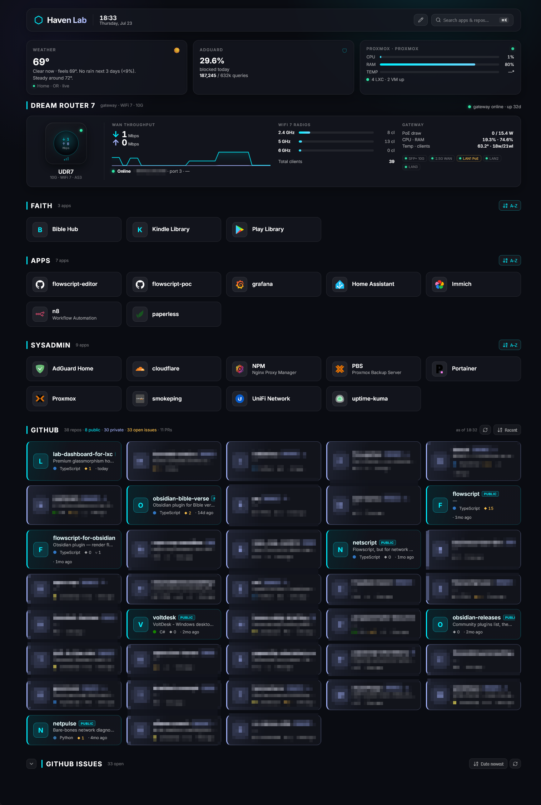

# Haven Lab Dashboard

Glassmorphism homelab dashboard for a lightweight Proxmox LXC: static UI + a small **Node broker** for live data (UniFi DR7, GitHub, Proxmox, AdGuard).



## Architecture (current)

| Piece | Role |
|--------|------|
| **Static UI** | Vite + React → `dist/` → nginx `/var/www/html` |
| **Broker** | `server/broker.ts` → built as `server.mjs` → systemd `havenlab-broker` (port **8787**) |
| **nginx** | Serves static files; `proxy_pass` `/api/*` → `127.0.0.1:8787` |
| **config.json** | Served from webroot (`/var/www/html/config.json`); not committed |

Secrets live only in the broker `.env` (never in the browser).

## Features

- Config-driven app tiles (categories, icons, search / ⌘K)
- **Per-category sort**: A–Z (default) or last used — persisted in `localStorage`
- **In-app config editor** (pencil): Apply in-session, or **Save to GitHub** via broker
- Live **GITHUB** section: all repos from API (~40), public vs private styling, A–Z / Recent, refresh
- Live **GITHUB ISSUES** section: open issues, collapsible, sort by name/date, refresh
- Live vitals: weather, AdGuard, Proxmox, Dream Router 7 (UniFi)
- Deploy with timestamped backups + restore; agent live cycle scripts

## Getting started (dev)

```bash
git clone https://github.com/kilrkrow/lab-dashboard-for-lxc.git
cd lab-dashboard-for-lxc
npm install
cp public/config.example.json public/config.json
cp .env.example .env   # fill UniFi / GitHub / Proxmox / AdGuard
```

Two terminals:

```bash
npm run broker    # :3000 — APIs + optional static from dist
npm run dev       # Vite; proxies /api and /config.json → broker
```

## Broker environment

See `.env.example`. Important GitHub vars (two-token model):

| Variable | Use |
|----------|-----|
| `GITHUB_TOKEN` (or `GITHUB_RO_TOKEN`) | RO — repo list, issues, PRs |
| `GITHUB_WRITE_TOKEN` | RW — **Save to GitHub** for config only (e.g. `homelab-stacks`) |
| `GITHUB_USER` | Search/list context (e.g. issues `user:…`) |

UniFi (DR7): prefer the same user/pass style as UniFiHUD, or `UNIFI_API_KEY`.  
Proxmox: `PROXMOX_HOST` (port **8006** defaulted if missing), `PROXMOX_TOKENID` + `PROXMOX_SECRET`.  
AdGuard: `ADGUARD_HOST` (use **http://** when NPM fronts `:80`).

Live LXC typically:

- Unit: `havenlab-broker.service`
- Dir: `/opt/havenlab-broker/` (`server.mjs`, `.env`)
- Config path: `CONFIG_PATH=/var/www/html/config.json`

## Configuration (`config.json`)

Runtime tiles and titles load from `config.json` next to the static site.

```json
{
  "title": "Haven Lab",
  "editConfigUrl": "https://github.com/YOUR_USER/YOUR_CONFIG_REPO/edit/main/path/config.json",
  "categories": [ … ]
}
```

- **Pencil editor**: Apply (session only) or Save to GitHub (needs write token + valid `editConfigUrl`).
- A static category named **GITHUB** in config is **ignored** (replaced by live GITHUB / GITHUB ISSUES sections).

Do not commit real `config.json` with private LAN URLs.

## Verify & CI

```bash
npm run check    # typecheck client+broker + production build
```

GitHub Actions runs the same gate on PRs / `main`.

## Deploy (Windows → LXC)

One-time: copy `deploy.env.example` → `deploy.env` (gitignored):

```env
LXC_USER=root
LXC_HOST=192.168.x.x
LXC_PATH=/var/www/html
LXC_SSH_KEY=C:\path\to\openssh_private_key
HAVEN_URL=http://192.168.x.x
BROKER_REMOTE_DIR=/opt/havenlab-broker
BROKER_RESTART_CMD=systemctl restart havenlab-broker
```

Use an **OpenSSH** private key (not PuTTY `.ppk`). Convert with MobaKeyGen if needed. Fix ACLs if OpenSSH complains about unprotected key.

```powershell
.\deploy.ps1 -WhatIf
.\deploy.ps1                 # static only path via deploy.ps1
.\agent-cycle.ps1            # check → static deploy → broker ship → smoke → auto-restore on homepage fail
.\smoke.ps1
.\restore.ps1 -List
.\restore.ps1
```

**Safety**

- Static deploy only replaces managed `dist/` paths (`index.html`, `assets/`, …); does **not** wipe `config.json`.
- Timestamped backups: `backups/lxc-yyyyMMdd-HHmmss-fff/` (gitignored).
- Broker: prefer a manual `server.mjs` backup before first ship; unit restart is `systemctl restart havenlab-broker`.

`publish.ps1` / LXC `update.sh` remain available for git-pull style workflows.

## Auth notes

- Prefer fine-grained PATs: RO for list/issues; separate RW only on the **config** repo for Save.
- Do not embed tokens in nginx configs long-term; broker holds secrets.
- SSH deploy keys / `gh auth` for git publish, not tokens in remotes.

## Icons

[walkxcode/dashboard-icons](https://github.com/walkxcode/dashboard-icons) CDN, or full URL / letter avatar fallback:

`https://cdn.jsdelivr.net/gh/walkxcode/dashboard-icons/png/[icon-name].png`

## Agent contract

See **AGENTS.md**: with `deploy.env` present, agents run `.\agent-cycle.ps1` for live iteration (check / deploy / smoke / restore) without asking you to re-run shell QA each cycle.
